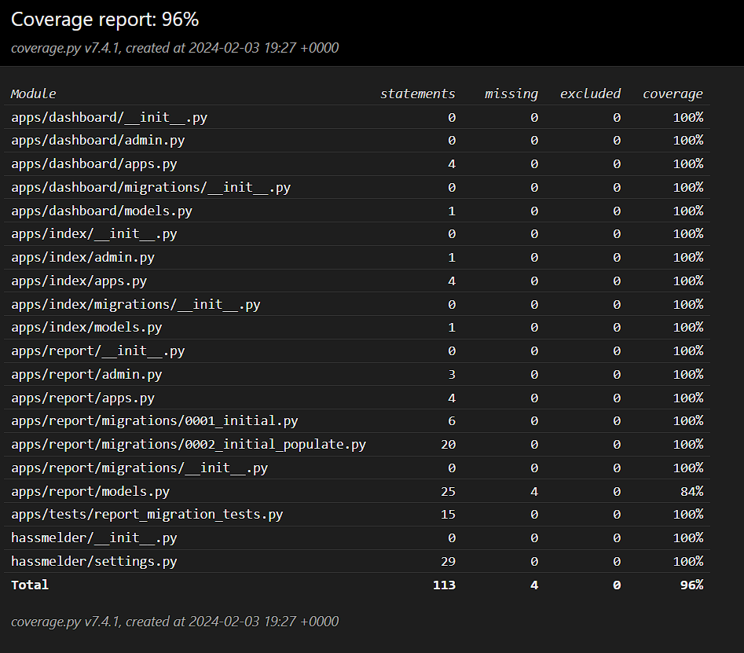

# Table of Contents
- [Table of Contents](#table-of-contents)
- [Welcome To NoHateNet](#welcome-to-nohatenet)
- [Quickstart](#quickstart)
  - [Start Docker-Desktop](#start-docker-desktop)
  - [Tips for Using Vim (Windows and macOS)](#tips-for-using-vim-windows-and-macos)
  - [Create .env File](#create-env-file)
  - [Switch Directory to Backend](#switch-directory-to-backend)
  - [Create Another .env File](#create-another-env-file)
  - [Build Containers](#build-containers)
  - [Create Super User](#create-super-user)
- [Testing](#testing)


# Welcome To NoHateNet
<p align="center"></p>

- Our app, NoHate, strives to eliminate negativity on social platforms.
- You can report negative posts by others to us.
- We have an ML model that identifies the category of hate a post falls under and suggests subsequent actions.
- Data scientists can view all the posts reported by users on our website.

<br/>
<br/>
<br/>

# Quickstart

## Start Docker-Desktop
   To get the Docker daemon running.


## Tips for Using Vim (Windows and macOS)
   - To quit Vim:
     1. Press `Esc` to ensure you're in Normal mode.
     2. Type `:q` and press `Enter`.
   - To quit and discard changes (force quit):
     1. Press `Esc` to ensure you're in Normal mode.
     2. Type `:q!` and press `Enter`.
   - To save changes and quit:
     1. Press `Esc` to ensure you're in Normal mode.
     2. Type `:wq` and press `Enter`.

## Create .env File
   Copy the provided `template.env` file and rename it to `.env`. 
   <br/>You can also enter your own credentials for each variable!

   **Example .env File:**
   ```dotenv
   # Database
   POSTGRES_DB=hassmelder
   POSTGRES_USER=postgres
   POSTGRES_PASSWORD=Casino+Poison+Unsmooth6
   POSTGRES_HOST=db
   POSTGRES_NAME=hassmelder
   POSTGRES_PORT=5432

   # MinIO
   MINIO_ROOT_USER=minio
   MINIO_ROOT_PASSWORD=minio123
   ```

## Switch Directory to Backend
   ``` bash
   cd backend
   ```

## Create Another .env File
   Repeat the step above!

   **Example .env File:**
   ```dotenv
   # Postgres DB
   POSTGRES_USER=postgres
	POSTGRES_PASSWORD=Casino+Poison+Unsmooth6
	POSTGRES_NAME=hassmelder

   # Django Settings
	SECRET_KEY=django-insecure-=yk3joc*f*uk9i2yz)dj%$$4h*g3211kj!x+r=@87=q9i6my9v
   DEBUG=True
   ALLOWED_HOSTS=.localhost,141.45.146.238,[::1]

   # Django DB URL
   DB_ENGINE=django.db.backends.postgresql
   DB_NAME=hassmelder
   DB_USER=postgres
   DB_PASSWORD=Casino+Poison+Unsmooth6
   DB_HOST=db

   # MinIO
   MINIO_ROOT_USER=minio
   MINIO_ROOT_PASSWORD=minio123
   ```

## Build Containers 
   ``` bash
   docker-compose up
   ```

## Create Super User
   First enter the django container by running:
   ``` bash
   docker exec -it django bash 
   ```

   Then run the django method to create a super user:
   ``` bash
   python manage.py createsuperuser
   ```

# Testing

   Django
   <br/>

   Our Test Coverage for the Django Backend <br />
   

   To run the tests go to the backend path and run in console:
   ``` bash
   pytest
   ```
# Swagger Doc

   Swagger URL: http://localhost:8000/swagger/
